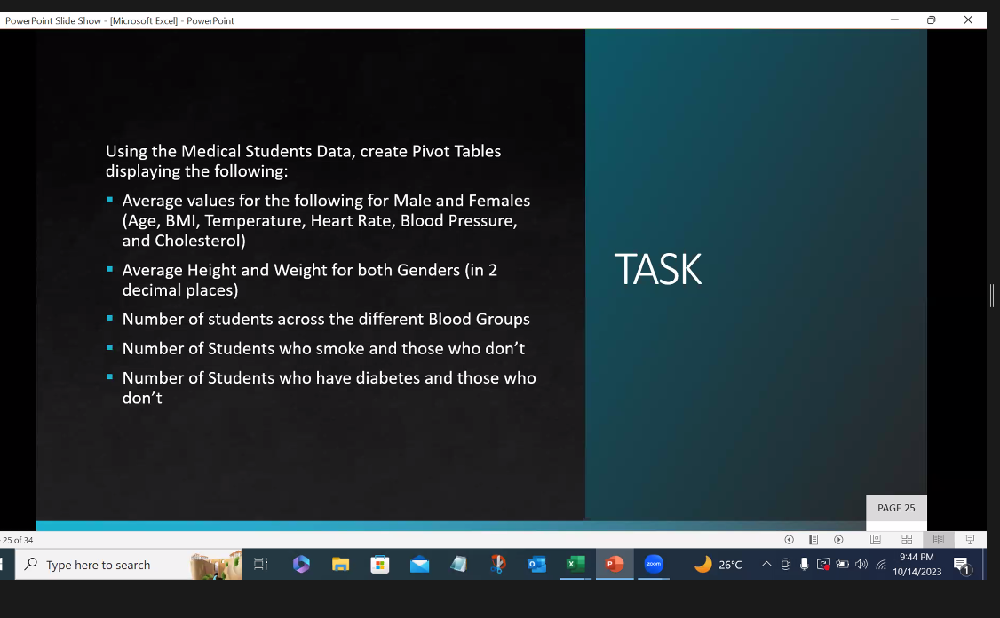
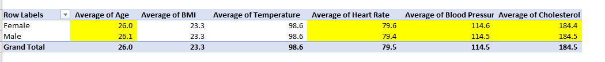
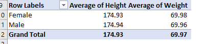
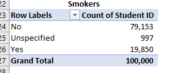
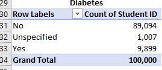
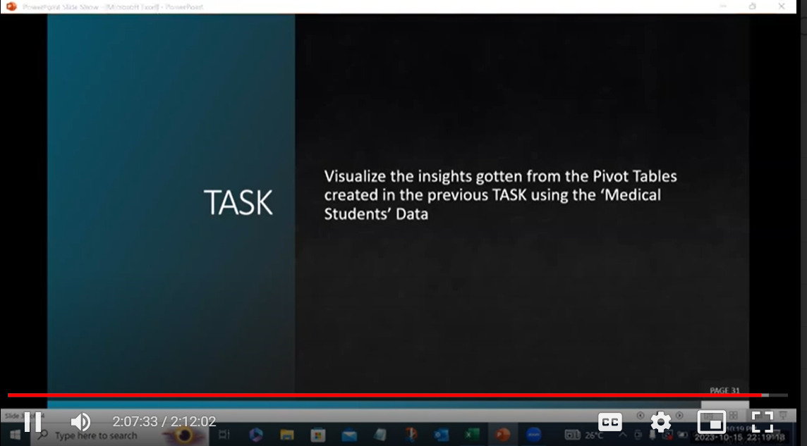
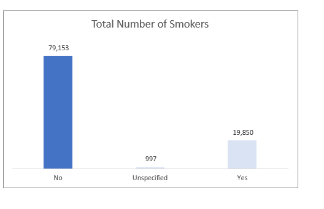
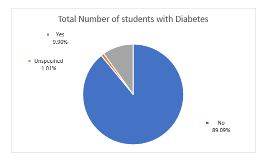
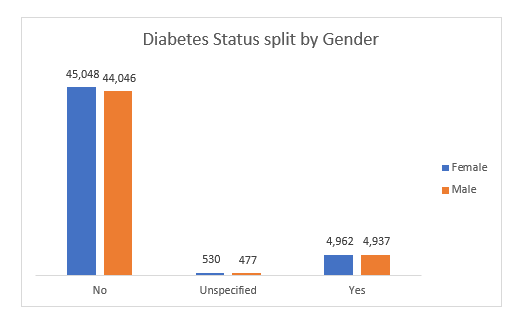

# Medical-Students-Dataset- Analysis

## Introduction
This analysis is based on Medical students dataset containing several Male and Female medical conditions. The goal of this analysis is to show several health conditions and generate insights from them to aid overall health improvements.

## *Data Cleaning*
I started out by downloading the file into excel (as it came as a csv file). Then I created a data table so i could navigate easily within the data. I calculated averages per column (for those with values) as i noticed there were several blanks in the data, then i proceeded to insert filter per column and filtered the blanks and then filled the blanks with the averages. For those without values, I inserted "Unspecified"

## Task 1 - PIVOT TABLES

## Answers
To answer and present my data appropriately, I created several pivot tables
1. The below shows the averages per several parameters and basically tells us that Males and Females are the same  for BMI and Temperature but slight differences for Age, Heart rate,Blood pressure and Cholesterol.
   
   
2. The average height for Male is slightly higher than for Females while the weight for Females are higher.
   
   
4. We have more students with the "O" Blood group, while the Blood group "A" is least common.
   
   
6. Out of the 100,000 students surveyed, over 79% of them do not smoke while 1% did not specify.
   
   
8. Over 89% of the students do not have diabetes, Only 10% have diabetes while the other 1% did not specify.
   
   

## Task 2 - VISUALIZATION

 

## Answers

## CONCLUSION AND RECOMMENDATION
Overall, the data shows that majority of the medical students are doing well in regards to their health. However, there still needs to be consistency and the few who are not doing well need to improve their overall health status. I recommend visits to the hospital and sticking to the doctors prescription.

   
